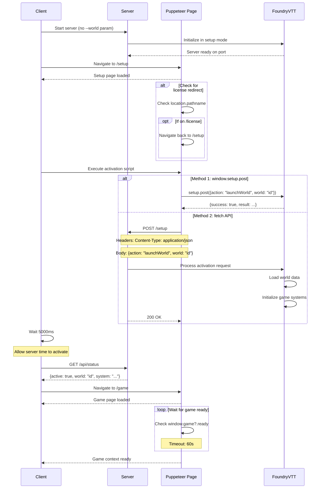

# SPIKE: Investigate FoundryVTT Setup API for World Activation

## Description
We need to understand FoundryVTT's setup API and world activation process to implement proper game session initialization. Current approach of using --world parameter isn't sufficient for activating the game context.

### Acceptance Criteria
- [x] Document the complete setup API endpoint for world activation
- [x] Identify required request payload and headers
- [x] Document server status response format
- [x] Map out full activation sequence with timing requirements
- [x] Document any authentication requirements
- [x] Identify potential error conditions and responses

### Tasks
1. Analyze foundry-puppeteer-poc.mjs implementation of setup API
2. Document working activation sequence from POC
3. Test API endpoints with different payload variations
4. Monitor server status changes during activation
5. Document all findings in spike report
6. Create sequence diagram of successful activation flow
7. List recommendations for implementation approach

### Investigation Focus
- Setup API endpoint structure
- World activation payload format
- Status response format
- Timing requirements between steps
- Error handling scenarios
- Authentication impact on activation
- Server state transitions

### Deliverables
1. API documentation
2. Sequence diagram
3. Implementation recommendations
4. Error handling guide
5. Example request/response pairs

## Investigation Findings

### 1. Setup API Endpoint Structure

**Primary Endpoint**: `/setup`
- **Method**: POST
- **Purpose**: Control FoundryVTT server state, including world activation
- **Authentication**: Not required for setup operations
- **Response**: JSON with operation result

**Alternative Methods**:
1. **Window.setup.post()**: Browser-side API available when on setup page
2. **Direct fetch()**: Standard HTTP POST to /setup endpoint

### 2. Request Payload Format

#### World Activation Request
```json
{
  "action": "launchWorld",
  "world": "<world-id>"
}
```

**Headers**:
```javascript
{
  "Content-Type": "application/json"
}
```

**Implementation Examples**:

```javascript
// Method 1: Using window.setup.post (if available)
if (window.setup?.post) {
    const result = await window.setup.post({
        action: 'launchWorld',
        world: worldId
    });
}

// Method 2: Using fetch API
const response = await fetch('/setup', {
    method: 'POST',
    headers: { 'Content-Type': 'application/json' },
    body: JSON.stringify({
        action: 'launchWorld',
        world: worldId
    })
});
```

### 3. Server Status Response Format

**Status Endpoint**: `/api/status`
- **Method**: GET
- **Purpose**: Check current server state
- **Response Format**:
```json
{
  "active": true,      // Game session active status
  "world": "testworld",  // Currently active world ID
  "system": "dnd5e",     // Active game system
  "version": "12.331"    // FoundryVTT version
}
```

### 4. World Activation Sequence

#### Step-by-Step Process:

1. **Start server WITHOUT world parameter**
   - This ensures we start in setup mode
   - Server starts on configured port (default: 30000)

2. **Navigate to setup page**
   - URL: `http://localhost:30000/setup`
   - Wait for page load (networkidle0)
   - Check for license page redirect

3. **Send activation request**
   - Use either window.setup.post or fetch API
   - Payload: `{"action": "launchWorld", "world": "<world-id>"}`

4. **Wait for activation**
   - Recommended wait: 5000ms
   - Server needs time to initialize world

5. **Verify activation via status API**
   - Check `/api/status` endpoint
   - Verify `active: true` and correct world ID

6. **Navigate to game page**
   - URL: `http://localhost:30000/game`
   - Wait for page load

7. **Wait for game context**
   - Wait for `window.game && window.game.ready === true`
   - Timeout: 60000ms (configurable)

### 5. Timing Requirements

**Critical Timing Points**:
- **Post-activation wait**: 5000ms minimum
- **Game ready timeout**: 60000ms default
- **Navigation timeout**: 30000ms default
- **Server start timeout**: 60000ms default

**Why timing matters**:
- World activation is asynchronous
- Server needs time to load world data
- Game initialization involves multiple subsystems
- Too short timeouts cause false failures

### 6. Error Handling Scenarios

#### Common Errors:

1. **License Page Redirect**
   - Detection: `window.location.pathname === '/license'`
   - Solution: Navigate back to /setup

2. **World Not Found**
   - Response: 404 or error in activation result
   - Solution: Verify world exists before activation

3. **Activation Timeout**
   - Symptom: Status remains `active: false`
   - Solution: Increase wait time or retry

4. **Game Context Failure**
   - Symptom: `window.game` never becomes ready
   - Solution: Check authentication, increase timeout

### 7. Authentication Considerations

- Setup API does NOT require authentication
- Game page MAY require authentication after activation
- Authentication happens AFTER world activation
- Admin password provides full access
- World password provides player access

### 8. Server State Transitions

```
[Server Start] → [Setup Mode] → [World Activation] → [Game Active]
     ↓                ↓                   ↓                  ↓
  Port bind      No active world    Loading world      Game ready
```

### 9. Implementation Recommendations

1. **Always start without --world parameter**
   - Allows manual activation control
   - Prevents race conditions

2. **Use status API for verification**
   - Don't rely on timing alone
   - Poll status until active

3. **Implement retry logic**
   - Activation can occasionally fail
   - Retry with exponential backoff

4. **Handle authentication separately**
   - Activate world first
   - Then handle auth if needed

5. **Use proper timeouts**
   - Don't use arbitrary waits
   - Configure based on system performance

### 10. Example Implementation Pattern

```javascript
class WorldActivator {
    async activateWorld(worldId) {
        // 1. Navigate to setup
        await page.goto('/setup');
        
        // 2. Send activation request
        const result = await this.sendActivationRequest(worldId);
        if (!result.success) throw new Error('Activation failed');
        
        // 3. Wait and verify
        await this.waitForActivation(worldId);
        
        // 4. Navigate to game
        await page.goto('/game');
        
        // 5. Wait for game ready
        await this.waitForGameReady();
    }
    
    async waitForActivation(worldId, maxAttempts = 10) {
        for (let i = 0; i < maxAttempts; i++) {
            const status = await this.checkStatus();
            if (status.active && status.world === worldId) {
                return true;
            }
            await new Promise(r => setTimeout(r, 1000));
        }
        throw new Error('Activation timeout');
    }
}
```

## Sequence Diagram



## Key Insights from Investigation

1. **Two-phase initialization**: Server start ≠ World activation
2. **Setup API is unauthenticated**: Security happens at game level
3. **Activation is asynchronous**: Must poll for completion
4. **Browser context matters**: window.setup only available on setup page
5. **Timing is critical**: Fixed waits prevent race conditions

## Validation Flow After Activation

Once the world is activated and game context is ready:

```javascript
// Validation becomes available through game context
const ItemClass = window.CONFIG?.Item?.documentClass;
const item = new ItemClass(data, { validateOnly: true });
```

## Next Steps

Based on this investigation, the implementation should:

1. Refactor server startup to not use --world parameter
2. Implement proper activation sequence with status polling
3. Add retry logic for activation failures
4. Separate authentication from activation logic
5. Use configurable timeouts instead of hard-coded values
